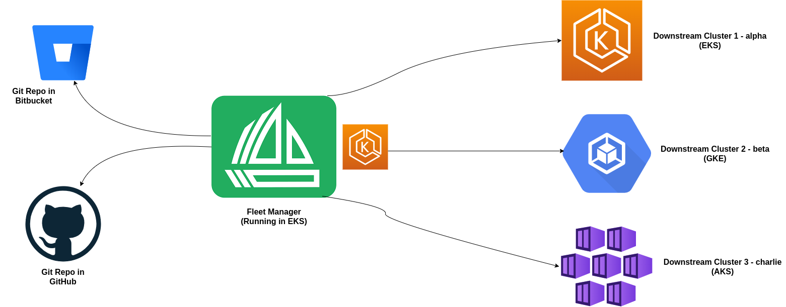

# Fleet Multi-Cluster Management (EKS, GKE, AKS) for Continuous Delivery
This repository contains source code to provision 4 hosted/managed Kubernetes clusters across three cloud providers:
* AWS - Your AWS environment will consist of two clusters: fleet (fleet manager) and alpha (downstream cluster 1)
* GCP - Your GCP environment will consist of one cluster: beta (downstream cluster 2)
* AKS - Your AKS environment will consist of one cluster: charlie (downstream cluster 3)



## Requirements/Prerequisites
- [AWS](https://aws.amazon.com/), [GCP](https://cloud.google.com/) and [AKS](https://azure.microsoft.com/en-us/) free-tier accounts
- [kubectl](https://kubernetes.io/docs/tasks/tools/)
- [Helm](https://helm.sh/docs/intro/install/)

## Create EKS Cluster
Refer to `fleet-eks-clusters/README.md`.

## Create GKE Cluster
Refer to `fleet-gke-cluster/README.md`.

## Create AKS Cluster
To be created.

## Fleet Controller Cluster & Downstream Cluster Registration
In order for your Fleet multi cluster management installation to properly work it is important the correct API server URL and CA certificates are configured properly. The Fleet agents will communicate to the Kubernetes API server URL. This means the Kubernetes API server must be accessible to the downstream clusters. You will also need to obtain the CA certificate of the API server.

Decode *certificate-authority-data* field from kubeconfig:
```
kubectl config view -o json --raw  | jq -r '.clusters[].cluster["certificate-authority-data"]' | base64 -d > ca.pem
```
*If you have multiple clusters in your kube config file, make sure to reference the correct one in order to decode the relevant certificate*

### Setup the environment with your specific values
```
API_SERVER_URL="https://172.16.128.21:6443"
API_SERVER_CA="ca.pem"
```

### Install Fleet CustomResourcesDefintions
```
helm -n fleet-system install --create-namespace --wait fleet-crd https://github.com/rancher/fleet/releases/download/v0.3.3/fleet-crd-0.3.3.tgz
```

### Install Fleet Controllers
```
helm -n fleet-system install --create-namespace --wait \
    --set apiServerURL="${API_SERVER_URL}" \
    --set-file apiServerCA="${API_SERVER_CA}" \
    fleet https://github.com/rancher/fleet/releases/download/v0.3.3/fleet-0.3.3.tgz
```

### Create Registration Token
Cluster registration tokens are used to establish a new identity for a cluster. Create the token below on the cluster with the Fleet manager.
```
kind: ClusterRegistrationToken
apiVersion: "fleet.cattle.io/v1alpha1"
metadata:
  name: new-token
  namespace: clusters
spec:
  # A duration string for how long this token is valid for. A value <= 0 or null means infinite time.
  ttl: 240h
```

```
kubectl create namespace clusters
kubectl apply -f raw-manifests/cluster-registration-token.yml
```

The token value is the contents of a values.yaml file that is expected to be passed to helm install to install the Fleet agent on your downstream cluster. 

The token is stored in a Kubernetes secret referenced by the status.secretName field on the newly created ClusterRegistrationToken.
```
kubectl -n clusters get secret new-token -o 'jsonpath={.data.values}' | base64 --decode > values.yaml
```

### Deploy Fleet Agent to Downstream Cluster
Change your kube context to the cluster where the agent will be deployed.
```
helm -n fleet-system install --create-namespace --wait \
    --values values.yaml \
    fleet-agent https://github.com/rancher/fleet/releases/download/v0.3.3/fleet-agent-0.3.3.tgz
```

The agent should now be deployed. You can check that status of the fleet pods by running the below commands.
```
kubectl -n fleet-system logs -l app=fleet-agent
kubectl -n fleet-system get pods -l app=fleet-agent
```

Deploy the agent to other downstream clusters by switching the context:
```
kubectl config use-context <cluster-name>
```

Change back to the kube context for your Fleet manager and run the following command:
```
kubectl -n clusters get clusters.fleet.cattle.io
```

## Mapping to Downstream Cluster
When mapping GitRepos to downstream clusters the clusters must be mapped to a target as shown below in the code block. Make sure the GitRepo objects are deployed to the same namespace used by the *ClusterRegistrationToken*.

```
kind: GitRepo
apiVersion: fleet.cattle.io/v1alpha1
metadata:
  name: name
  namespace: clusters
spec:
  repo: <gitrepo-url>
  paths:
  - manifests
  targets:
  - name: cluster-name
    clusterSelector:
      matchLabels:
        fleet.cattle.io/cluster: cluster-name
```

Save this YAML in a manifest file and deploy it to your Fleet manager cluster. 
```
kubectl apply -f <git-repo-manifest>
```

Lastly, you can review your GitRepo deployment to check the status of Fleet cloning the repo and deploying the resources to the downstream cluster. Make sure the repo being cloned matches the [expected structure](http://fleet.rancher.io/gitrepo-structure/) for Fleet.

## Uninstall Fleet
Commands to run on fleet manager
```
helm -n fleet-system uninstall fleet
helm -n fleet-system uninstall fleet-crd
```

Commands to run on downstream clusters (alpha, beta and charlie):
```
helm -n fleet-system uninstall fleet-agent
```
